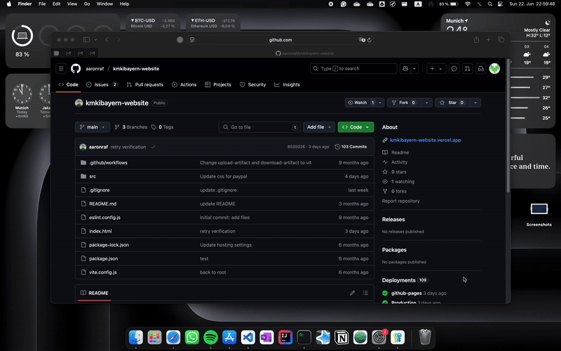

# KMKI Bayern's Website

This is the official community landing page for [**KMKI Bayern**](https://instagram.com/kmkibayern), designed for public exposure and easy access to events and information related to the Indonesian Catholic Student Community in Bavaria.

🌐 **Live Site:** [kmkibayern.com](https://kmkibayern.com) - currently only in Indonesian

## 🧩 Features

- Built with **React** and **Vite**
- Integrated with **Google Calendar API** to display past and upcoming events dynamically
- Clean, simple design focused on accessibility and clarity

## 🔧 Tech Stack

- [React](https://reactjs.org/)
- [Vite](https://vite.dev)
- Google Calendar API

## 📌 Usage

Anyone can visit the site to stay updated on KMKI Bayern events and activities.

> 🔒 **Note:** While the repository is public, only authorized committee members can make contributions or deploy updates to production.

## 🛠️ Development Setup (khusus untuk PK baru)

Untuk submit feature / update baru:
- Fork repository ini
- Clone repository ke local directory
- Buat update yang diinginkan
- Push changes ke github
- Submit pull request (beri keterangan jelas; nama, periode, usw.)

Cara fork repository:



```bash
# Clone repository
git clone <link-to-forked-repository>

# Navigate into the project directory
cd kmkibayern-website

# Install dependencies
npm install

# Start the development server
npm run dev
```
